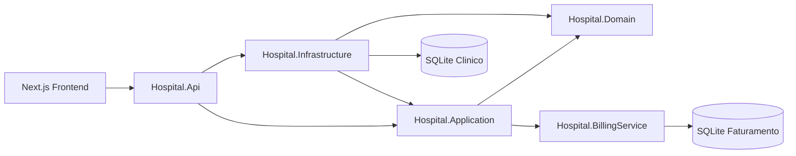
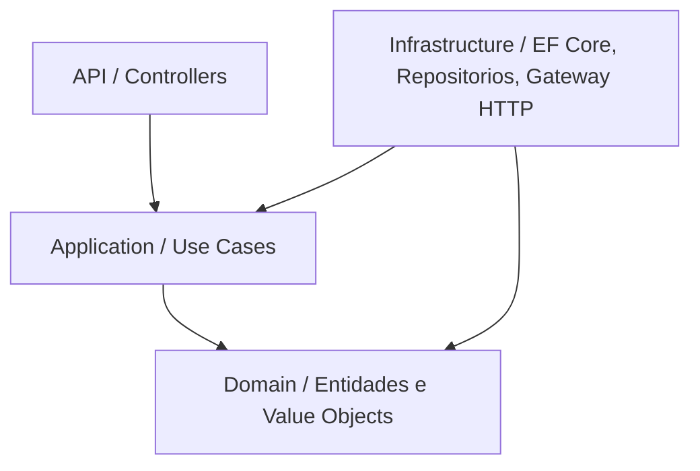

# Arquitetura

## Visao geral

O `hospital-engineered` organiza o sistema em camadas e modulos. A API principal concentra os fluxos clinicos e envia um evento HTTP para o `Hospital.BillingService` quando uma alta e concluida.

## Dependencias

- `Hospital.Domain` nao depende de nenhum projeto.
- `Hospital.Application` depende de `Hospital.Domain`.
- `Hospital.Infrastructure` depende de `Hospital.Application` e `Hospital.Domain`.
- `Hospital.Api` depende de `Hospital.Application` e `Hospital.Infrastructure`.
- `Hospital.BillingService` e separado e possui banco proprio.

## Clean Architecture

