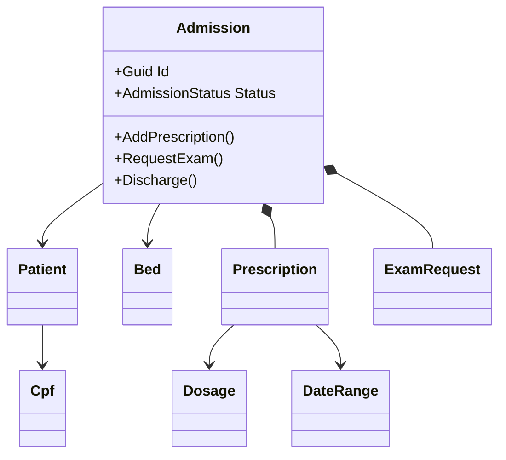

# DDD aplicado ao fluxo de internacao

## Linguagem ubiqua

- Paciente: pessoa atendida pelo hospital.
- Leito: recurso fisico usado para internacao.
- Internacao: aggregate root que controla alta, prescricoes e exames.
- Prescricao: ordem medica vinculada a internacao ativa.
- Exame: solicitacao clinica vinculada a internacao ativa.
- Alta: encerramento da internacao depois que pendencias sao resolvidas.

## Aggregate

## Regras modeladas

- Internacao exige paciente existente.
- Internacao exige leito disponivel.
- Paciente nao pode ter duas internacoes ativas.
- Prescricao exige internacao ativa.
- Exame exige internacao ativa.
- Alta e bloqueada por exame pendente.
- Alta e bloqueada por prescricao ativa.

## Bounded context

O contexto clinico fica na API principal. O faturamento fica em servico separado para demonstrar fronteira entre modulos.
