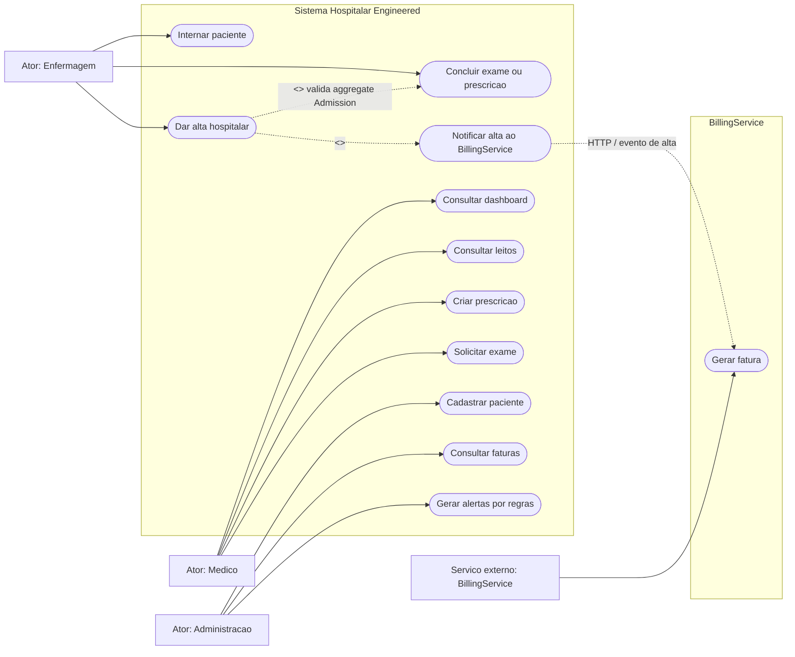

# Diagrama de casos de uso - hospital-engineered

Versao engineered: os casos de uso seguem o mesmo fluxo do legacy, mas estao alinhados a use cases de aplicacao, regras de dominio e fronteira externa de faturamento.

## Leitura do diagrama

- Os perfis aparecem na interface, mas ainda nao ha autorizacao real no backend.
- `Dar alta hospitalar` valida as regras no aggregate `Admission`.
- `Notificar alta ao BillingService` separa o contexto clinico do contexto de faturamento.
- `Gerar alertas por regras` representa o uso de estrategias `IAlertRule`.
