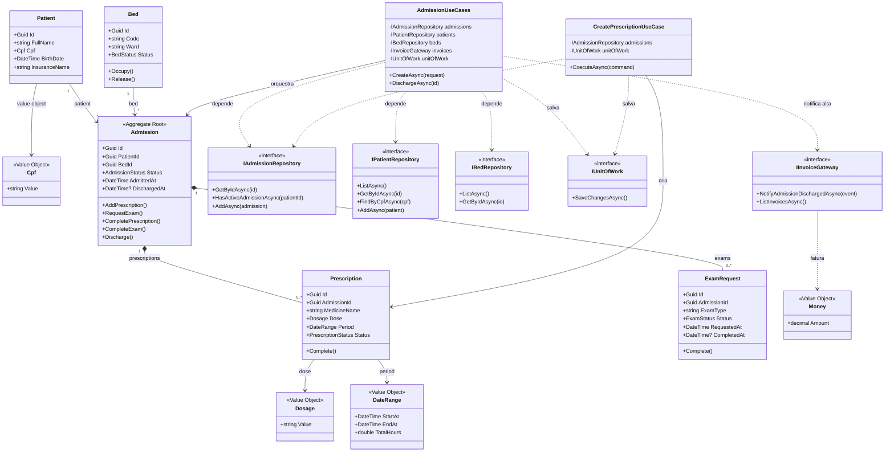

# Diagrama de classes - hospital-engineered

Versao engineered: o dominio possui entidades com comportamento, use cases orquestram o fluxo e interfaces isolam infraestrutura e faturamento.

## Leitura do diagrama

- `Admission` e o aggregate root do fluxo de internacao.
- A alta e bloqueada quando existem exames pendentes ou prescricoes ativas.
- `Cpf`, `Dosage`, `DateRange` e `Money` sao value objects.
- Os use cases dependem de interfaces, nao diretamente de EF Core, SQLite ou HTTP.
