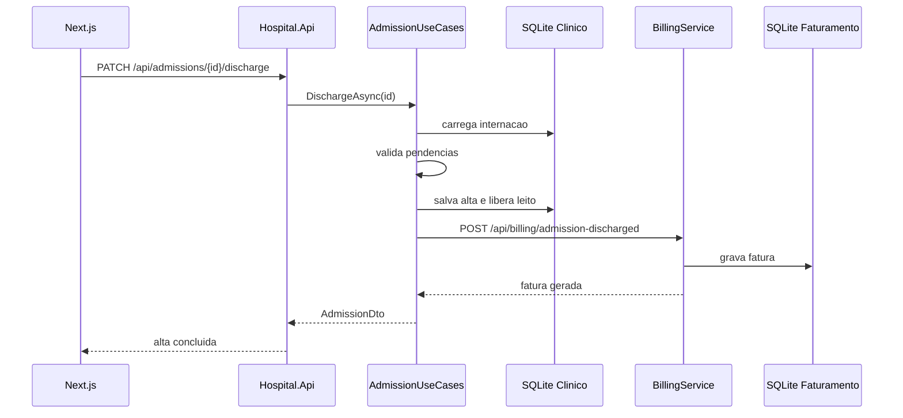

# Microsservicos

## Decisao do projeto

O seminario usa uma arquitetura hibrida leve:

- API principal modular e organizada;
- BillingService separado para demonstrar comunicacao entre servicos;
- SQLite separado para faturamento.

## Sequencia de alta e faturamento

## Tradeoffs

- Vantagem: fronteira clara entre clinico e faturamento.
- Vantagem: demonstra banco por servico.
- Limite: comunicacao e sincronizacao ainda sao simples.
- Limite: nao ha mensageria real para manter o escopo adequado ao seminario.
