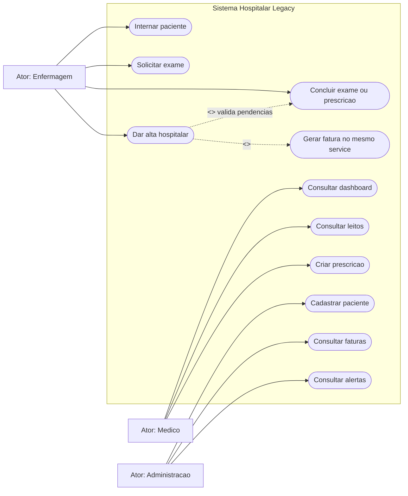

# Diagrama de casos de uso - hospital-legacy

Versao legacy: os casos de uso existem no produto, mas ficam implementados de forma centralizada no `HospitalService`.

## Leitura do diagrama

- Os atores acessam o mesmo sistema sem controle real de permissao.
- A alta inclui validar pendencias e gerar fatura.
- No legacy, esses casos nao viram classes de aplicacao separadas; eles ficam dentro do `HospitalService`.
