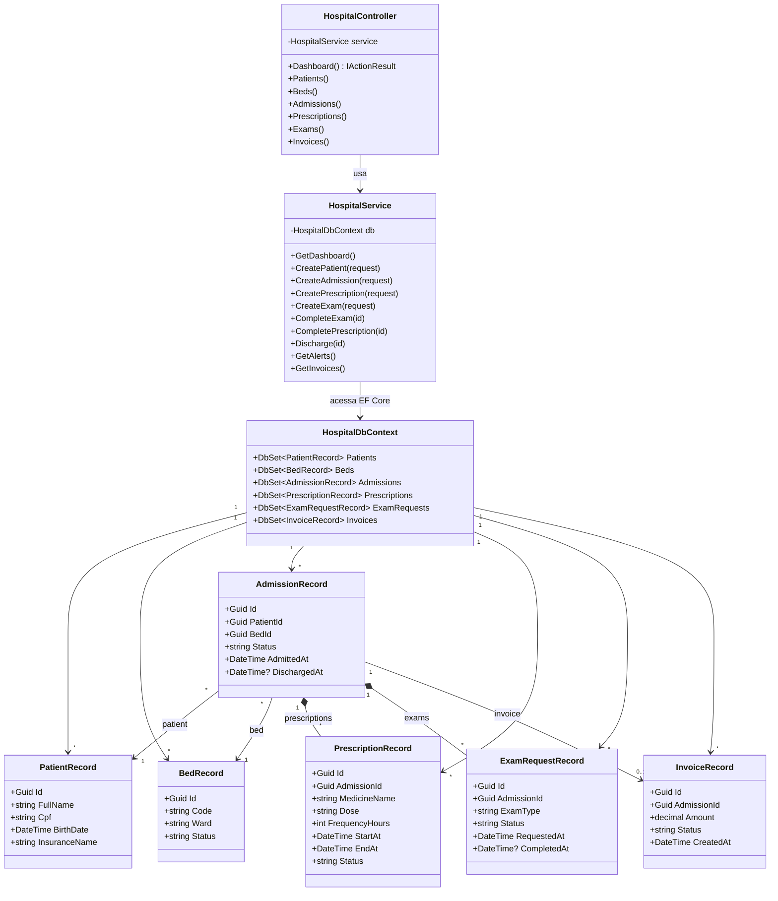

# Diagrama de classes - hospital-legacy

Versao legacy: controller, service, DbContext e records ficam ligados diretamente. O foco do diagrama e mostrar a concentracao de responsabilidades no `HospitalService`.

## Leitura do diagrama

- O `HospitalService` concentra pacientes, internacoes, prescricoes, exames, alertas e faturamento.
- Os `Record` sao usados como modelo de banco e base para resposta da API.
- Os status sao strings soltas, como `INTERNADO`, `ALTA`, `PENDENTE` e `ATIVA`.
- A regra de alta e a geracao de fatura ficam no mesmo metodo de service.
